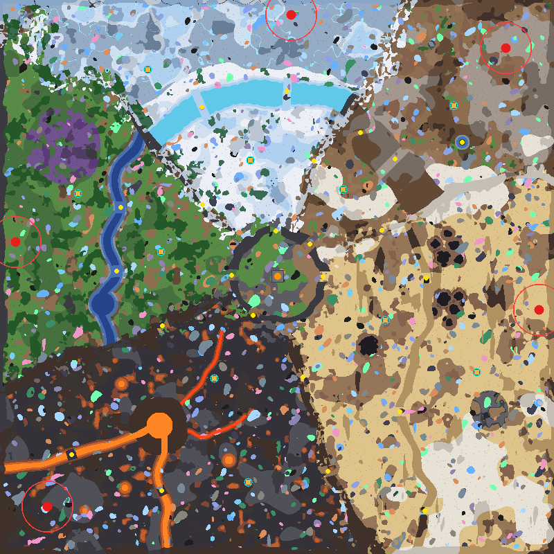
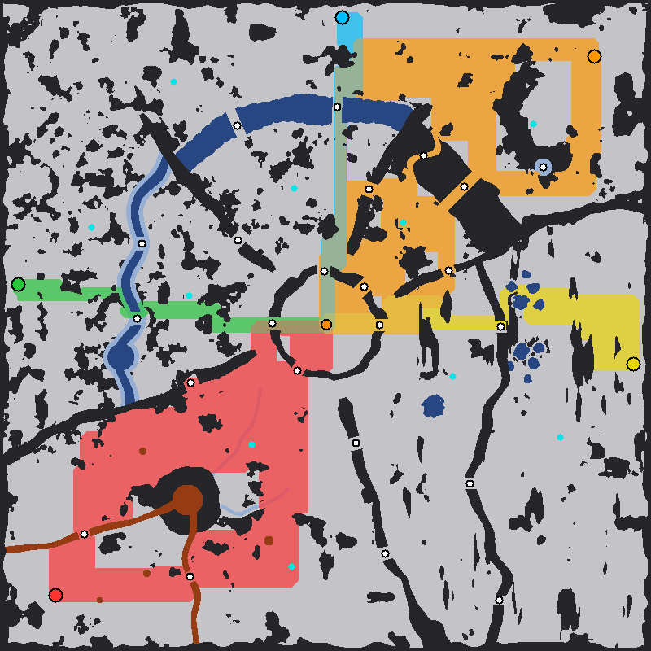

# Biomes Extended Remastered

An 800×800 PvE survival map for **Mindustry v8 Build 159.7**, designed for **4–8 players** and the
**Exogenesis Old** mod (`exogenesisold` 1.9.1). One player core sits in the centre. Five biomes surround
it, and each one sends out the Exogenesis faction that matches its theme. **Ore nodes are re-rolled by
the game every time the map is loaded.** Every ore can turn up in every biome, and each biome only
*leans* toward the materials its faction's tech tree needs.

| | |
|---|---|
| Map file | `maps\Biomes Extended Remastered.msav` (save format 13) |
| Size | 800 × 800 tiles (640,000) |
| Mode | Survival / PvE, endless waves |
| Player core | Core: Foundation at the centre (tiles 399–402 × 399–402) |
| Enemy spawns | 5 spawn points, one per biome, all near the map edge |
| Ore nodes | Random on every load: about 1,240 patches per game, all 12 ores + siratla crystal in every biome |
| Lava | Thermal generators can be built anywhere on it (molten slag and pyromagma), not only on the banks |
| Session length | Wave 100 at ~4 h 15 min, wave 120 at ~5 h 05 min (players can call waves early) |
| Required mod | Exogenesis Old 1.9.1 (needs game build 158 or newer) |



*Preview: red circles are enemy spawns with their 37.5-tile drop zones, cyan rings are outpost pads,
yellow dots are named choke points, and orange marks the core. North is up. The ore patches are
**one example roll**; every game gets its own.*

---

## 1. Install and play

1. Turn on **Exogenesis Old** under *Mods* and restart the game.
2. From the main menu open **Editor → Import Map** and pick
   `maps\Biomes Extended Remastered.msav` in this project's folder.
   (Or copy the file into the game's `maps` folder.)
3. Choose **Play → Custom Game → Biomes Extended Remastered → Survival**, or host it for friends.

The wave list, loadout and rules are stored in the map file. You can change them in the editor
under *Map Info → Rules / Waves*.

**Built-in rules:** 7 minutes to set up before wave 1, then one wave every 150 s. Players may call
waves early. The waves never end. Spawn points are visible. Each unit type has a cap of 24, plus 16
from the Foundation core (more with bigger cores). The starting loadout is 700 copper and 300 lead.

**Random ores.** The ore patches are not drawn into the map. The map stores a list of ore
*generation filters*, and the game runs them with a fresh random seed every time the map is loaded,
whether you start a custom game or host a server. A saved game keeps the ores it rolled. In the editor
the map opens without ores; *Map Info → Generation* lists the filters, previews a roll and lets you
tune them.

**Thermal generators on lava.** Two small data patches stored in the map make all lava usable:
- Molten slag (the two lava rivers, the crater and the pools) takes thermal generators anywhere,
  including the middle of a river or the crater. Normally they only fit where they touch the bank.
- The pyromagma creeks get heat. This Exogenesis lava had none, so no thermal generator could stand on it.

The patches are active only while this map is loaded.

---

## 2. Layout

| Direction | Biome | Spawn (x, y) | Enemy faction |
|---|---|---|---|
| North | Frozen / cryofluid | (420, 778) | **Genesux**, the cold faction |
| North-east | Semi-arid steppe | (730, 730) | **Titan host**: vanilla lines plus Exogenesis tier 6/7 |
| East | Desert | (778, 352) | **Elecian** |
| West | Forest | (22, 450) | **Quantra** plus Exogenesis titans |
| South-west | Volcano | (68, 68) | **Solran**, the molten faction |
| Centre | Crossroads Basin | core at (400, 400) | — |

Vanilla Serpulo units (dagger up to corvus) come out of **every** spawn.

The map is built from three rings:

- **Crossroads Basin (radius ~60):** a calm stone-and-grass bowl around the core. Its stone floor
  leans toward copper and lead, so the start always has them.
- **Crossroads Rim:** a stone ring 9–13 tiles thick. The only ways through are **five 16-tile gates**,
  one facing each biome.
- **Ring Road (just outside the rim, to r ≈ 92):** an open band that connects all five gates.
  Separator ridges between the biomes start just beyond it.

Each biome is then cut in two by a natural barrier. The **core side** is safe to expand into. The
**enemy side** holds the spawn and the rest of the biome's land and ore. The barrier can only be
crossed at named choke points (section 5).

---

## 3. Biomes and resource distribution

### How the ores are placed

Ore nodes are **rolled by the game every time the map is loaded** (section 1), so every game has a
different layout. The map's ore filters work in two layers:

- **Every ore, everywhere.** Each of the 12 ores has a map-wide filter that can put patches on any
  open ground of any biome. Copper and lead get the most patches; the Erekir and Exogenesis ores
  get the fewest. Siratla crystal (astrolite) is rolled on the main floor of every biome.
- **Biome tendencies.** Fifteen extra filters add patches of chosen ores on a floor that (nearly)
  only one biome has, for example thorium, tungsten and beryllium on volcanic basalt. That makes
  those ores roughly 1.5–2.5× as common in their biome. They never take ore away from another biome.

A game gets about **1,240 patches**, 2.9× the 429 of the old fixed layout. That is about 15% fewer
patches and ore tiles than the first random layout (1,440 patches). The cut removes whole patches
and keeps their size: median 34 ore tiles, 80% of them between 10 and 85. Ore never covers the outpost
pads, the core plaza or the spawn markers. The **start is always supplied**: in 30 test rolls the
area inside the Crossroads Rim held at least 1 copper and 1 lead patch every time (about 4.5 copper
and 5.3 lead on average). Within the Ring Road there were never fewer than 4 copper and 3 lead patches.

### Ore patches per biome (typical game)

Average of 5 simulated rolls of the game's own filters (`generate_map.py --ore-rolls 5`, seed 1597).
A single game varies around these numbers. In 10 further test rolls the whole map had 1,205–1,311
patches, a biome's total varied by 4–7% (standard deviation; 16% for the small basin) and one ore in
one biome typically by about 22%. **Bold** marks a biome tendency.

| Resource | Basin | Forest (W) | Volcano (SW) | Frozen (N) | Semi-arid (NE) | Desert (E) |
|---|---|---|---|---|---|---|
| copper | **6** | 15 | 25 | 20 | 15 | 31 |
| lead | **5** | **29** | 23 | 20 | 12 | 26 |
| coal | 5 | **25** | 23 | 16 | 15 | 26 |
| scrap | 1 | 12 | 18 | 15 | 10 | **50** |
| titanium | 2 | 22 | 22 | **39** | **18** | 26 |
| thorium | 2 | 14 | **33** | 16 | 10 | 22 |
| beryllium | 1 | 11 | **37** | 11 | 7 | 16 |
| tungsten | 2 | 13 | **39** | 14 | 10 | 23 |
| dytrix (Exo) | 1 | 12 | 14 | 11 | **17** | 19 |
| urbium (Exo) | 2 | 10 | 20 | 14 | 9 | **39** |
| siradamite (Exo) | 2 | 11 | 18 | **24** | 10 | 18 |
| stellar steel (Exo) | 1 | 11 | 18 | **25** | 7 | 24 |
| siratla crystal (Exo) | 1 | 8 | 10 | **16** | 5 | 11 |
| **All patches** | **32** | **192** | **301** | **242** | **144** | **331** |
| Ore tiles | 1,458 | 7,784 | 12,930 | 10,480 | 6,085 | 14,960 |
| Old fixed layout | 19 | 68 | 88 | 89 | 89 | 76 |

Big biomes get more patches because density is even: about 24–30 patches per 10,000 walkable tiles
everywhere. The Volcano tendencies come out at 1.6× (thorium), 2.5× (beryllium) and 1.9× (tungsten)
the density elsewhere. Frozen titanium is 2.1×, Desert scrap 2.3× and urbium 1.8×, Forest lead 1.7×
and coal 1.5×, Semi-arid dytrix 2.2×. The basin's grass also picks up some of the Forest's coal
tendency.

### Terrain resources (fixed)

Liquids and special floors are part of the terrain, because the rivers and lakes are also the
barriers. They are the same in every game.

| Biome | Area (tiles) | Liquids and special floors (tiles) |
|---|---|---|
| **Crossroads Basin** (centre) | 10,801 | darksand (sand) 1,843 |
| **Forest** (W) | 110,963 | **water 7,967** (Great River, Mirror Lake, fords) · spore moss 6,322 · sand/darksand 1,308 |
| **Volcano** (SW) | 148,025 | **lava (molten slag) 4,353** · **pyromagma 983** (Exo, pumps pyroplasma) · hotrock/magmarock 18,045. Thermal generators can stand on all of them. |
| **Frozen** (N) | 112,525 | **pooled cryofluid 9,055** · **glowing vein 1,821** (Exo, pumps cold plasma) |
| **Semi-arid** (NE) | 89,200 | shale (oil bonus) 6,222 · darksand 6,667 · oasis water 373 |
| **Desert** (E) | 168,486 | **tar (oil) 2,205** · shale (oil bonus) 13,842 · sand/darksand 120,431 |

### What each biome is for

- **Crossroads Basin.** Leans to copper and lead, with darksand for silicon, but any ore can roll
  here. There is no water or oil, so you still have to expand.
- **Forest (W).** Water for pumps, extra coal and lead, and spore moss for cultivators and spore
  presses (**Spore Hollow**, north-west). Quantra's gamma-green (Irradiation Kiln) needs this water.
- **Volcano (SW).** Leans to thorium and the two Erekir ores that Exogenesis' **Solran** tech uses:
  beryllium + sand → *volcanite* at the Ignition Forge, and tungsten for the Primal Forge and Hadel
  Furnace. Molten slag feeds slag separators and Exogenesis' Core Drill, and it is the best ground
  for thermal generators. Pyromagma creeks run toward the core side.
- **Frozen (N).** Leans to titanium. Cryofluid lakes can be pumped directly, which skips the
  cryofluid mixers. The **Siratla Glacier** (r > ~305) leans to the core **Genesux** materials:
  siradamite and stellar steel ores, siratla crystal (astrolite) and glowing veins (cold plasma).
- **Semi-arid (NE).** Leans to Exogenesis **dytrix** (on the dacite) and some titanium. The
  **Last Oasis** gives water on the far side.
- **Desert (E).** Leans to scrap and Exogenesis **urbium**. Oil from tar pits and shale for
  plastanium, which Quantra and Elecian alloys need. The **Derelict Wreck Field** (south-east) is a
  scrap ruin.

### Outposts (core-zone pads)

Ten 7×7 `core-zone` pads let players **build a new core directly on them**: Shard, Foundation or
Nucleus. A forward core cuts hauling time and gives a respawn point. The first pad in each biome is
on the safe core side. The second sits on the frontier, which in four biomes means past the choke
points on the enemy side.

| Biome | First pad (core side) | Second pad (frontier) |
|---|---|---|
| Frozen | Rimeward Outpost (361, 568) | Siratla Outpost (213, 699): enemy side, on the glacier |
| Semi-arid | Steppe Outpost (495, 526) | Oasis Outpost (655, 647): enemy side, beyond the mesas |
| Desert | Dunewatch Outpost (556, 337) | Wreckage Outpost (688, 262): enemy side, east of the dune wall |
| Forest | Riverbank Outpost (232, 436) | Sporewood Outpost (112, 520): enemy side, west bank |
| Volcano | Ember Outpost (309, 253) | Ashfall Outpost (358, 103): core side, in the Ash Fields facing the South Basalt Bridge |

---

## 4. Terrain transitions

Biome borders follow a noise-warped angle (±6°), so they wander instead of running as straight
spokes. Floors dither across a 9–23-tile blend band. Five **separator ridges** sit on the borders.
Each is 13–19 tiles thick, which also stops legged units: Mindustry only lets legs walk over rock
bands thinner than about 5 tiles.

| Border | Ridge (extent) | What the transition looks like |
|---|---|---|
| Basin → every biome | Crossroads Rim (r ≈ 60) | Stone and grass give way to each biome's ground along the Ring Road. Basin floor bleeds out through the gates. |
| Desert ↔ Semi-arid (22°) | **Salt Escarpment**, Ring Road to the map edge | Salt flats on both sides of a sand-and-dacite escarpment. |
| Semi-arid ↔ Frozen (68°) | **Rime Bluffs**, r 92–300 | Beyond r 300 it opens into a **tundra steppe**: dirt dotted with snow and ice-snow. |
| Frozen ↔ Forest (135°) | **Taiga Wall**, r 92–345 | A **boreal taiga** band: snow pines on snow and pines on grass. The open NW taiga corner lies beyond r 345. |
| Forest ↔ Volcano (205°) | **Ashwood Ridge**, Ring Road to the map edge | **Burnt forest**: char floors and dead white trees fading into basalt. |
| Volcano ↔ Desert (285°) | **Obsidian Wall**, Ring Road to the map edge | **Ash dunes**: darksand mixed into basalt and sand. |

Signature terrain inside the biomes:

- **Volcano.** A volcanic cone about 40 tiles in radius at (230, 185), around a molten-slag crater. Two **lava
  rivers** run to the west edge and the south edge, which walls off the south-west corner. Smaller
  lava pools and two pyromagma creeks are scattered through the rest of the biome. Thermal generators
  can be built anywhere on the lava, creeks included. Adjacent generators share power, so a field of
  them reaching the bank feeds a power node there; enemies still cannot walk across.
- **Forest.** The **Great River** meanders from the Taiga Wall to the Ashwood Ridge through
  **Mirror Lake** (148, 360). Its banks are darksand and mud, and pine groves form natural cover.
  **Spore Hollow** is a purple spore-moss grove in the north-west.
- **Frozen.** A ring of **pooled-cryofluid lakes** at r ≈ 268 separates the inner tundra from
  the **Siratla Glacier**. Ice cliffs and snow pines are scattered around.
- **Semi-arid.** A **mesa arc** (r 212–268) of dirt and dacite plateaus, crossed by two canyons.
  The rest is dry steppe with shale and salt pans.
- **Desert.** A meandering **dune wall** (x ≈ 570–630) splits the sea of sand. Tar pits sit at the
  Tar Narrows and Black Lake. There is a salt pan in the south-east and the derelict wreck field.

---

## 5. Choke points

Coordinates are tile (x, y) as shown in the editor, with the origin at the bottom-left. Every
barrier was tested by closing its crossings and checking that the far side becomes unreachable on
foot (`check_map.py`; all five tests pass).

### Outer crossings (enemy side → core side)

| Biome | Choke point | Position | Width | Barrier it crosses |
|---|---|---|---|---|
| Frozen | **Frost Bridge East** / **Frost Bridge West** | (414, 668) / (291, 645) | 12 | ice causeways through the cryofluid lake ring |
| Semi-arid | **Red Canyon** / **Dust Canyon** | (570, 570) / (520, 608) | 14 / 9 (winding) | the mesa arc |
| Desert | **Tar Narrows** / **Salt Pass** / **Southern Breach** | (615, 398) / (577, 205) / (613, 62) | 15 / 13 / 11 | the dune wall; the Narrows run between two tar-pit fields |
| Forest | **North Ford** / **South Ford** | (174, 500) / (168, 408) | 17 | shallow water across the Great River |
| Volcano | **West Basalt Bridge** / **South Basalt Bridge** | (103, 143) / (233, 91) | 14 | cooled-basalt crossings over the lava rivers |

### Inner gates (Crossroads Rim, 16 tiles wide each)

East Gate (466, 400) · North-east Gate (447, 447) · North Gate (398, 466) · West Gate (334, 402) ·
South-west Gate (365, 344).

### Ridge passes (core side ↔ core side, so defenders can shift between fronts)

Salt Gap (551, 467) desert ↔ semi-arid · Rime Pass (453, 567) semi-arid ↔ frozen ·
Taiga Pass (292, 504) frozen ↔ forest · Cinder Pass (234, 329) forest ↔ volcano ·
Obsidian Gate (437, 255) and Far Obsidian Gate (473, 119) volcano Ash Fields ↔ desert.

Enemies can use these passes too. On the enemy side, armies can only mix in two places: the tundra
(north ↔ north-east) and the NW taiga corner (forest west bank ↔ glacier).

### Measured enemy routes

Mindustry's flow field moves in four directions, so several routes often cost the same. The table
lists every choke point that lies on a route within 2% of the shortest one.

| Spawn | Shortest ground path | Likely choke points |
|---|---|---|
| North (Frozen) | 439 tiles | Frost Bridge East → North Gate |
| North-east (Semi-arid) | 691 tiles | Red Canyon or Dust Canyon → North-east Gate, North Gate (via Rime Pass) or East Gate (via Salt Gap). This army can split three ways. |
| East (Desert) | 567 tiles | Tar Narrows → East Gate |
| West (Forest) | 455 tiles | South Ford → West Gate |
| South-west (Volcano) | 661 tiles | West or South Basalt Bridge → South-west Gate, or Cinder Pass → West Gate |



*Each colour shows one spawn's set of near-shortest ground routes: cyan north, orange north-east,
yellow east, green west, red south-west. Black is rock, blue is deep water or cryofluid, brown is
lava, and white dots are choke points.*

Flying units ignore all of this. They enter from the map edge in the direction of their spawn.

---

## 6. Waves

There are 96 spawn groups. Faction groups are pinned to their own spawn point. Vanilla groups spawn
at all five, so their counts are multiplied by 5.

| Phase | Waves (time) | What arrives |
|---|---|---|
| Landfall | 1–12 (0:07–0:35) | Vanilla tier 1: dagger, flare, crawler, nova |
| Factions emerge | 8–30 | Faction tier 1–2 from each biome: b01/b02 Genesux, sol/heat/corona/molten, challenge/disrespect/dispute/strife, pteris/irises/guardian/aster, plus the north-east dust swarm |
| Escalation | 28–56 (~1:15–2:25) | Tier 3–4: b03/b04, photosphere/magma/radiative/lava, combat/disagreement/disaccord, urtica/thymus, vanilla fortress → vela |
| Siege | 56–89 (~2:25–3:50) | Tier 5–6: b05/b06, core/eruption/Fusion, hostile/assault/contention, anvil/toxicity/virgo, stella/T-nemesis/T-atlas/T-prometheus/twilight/hex, vanilla reign/eclipse/toxopid/corvus |
| Apocalypse | 90+ (~3:50 →) | Tier 7: b07-atlas/universalis, collapse, bloodshed/battle, xenoct/fornax, nadir/colossus, plus apex bosses |

**Milestone guardians (boss status: ×1.5 health, ×1.3 damage).** At wave 25, a boss fortress comes
from each spawn. At wave 50 it's a boss scepter, and at wave 75 a boss reign with 2,000 shields.
At wave 90 each faction sends a **Herald**: b06-eros, Fusion, assault, virgo and T-prometheus,
each with boss status and 5,000 shields.

**Apex bosses.** Each one has boss status and repeats every 30 waves. Its shields grow every wave
after its first appearance.

| Boss | First wave | From | Base stats | Shield growth |
|---|---|---|---|---|
| sagittarius | 100 (~4:15) | North | 10,000,000 HP, 144 armour | +3,000 per wave |
| xenoct ×2 | 105 | West | 210,000 HP each | +1,500 per wave |
| arcturus | 110 (~4:40) | South-west | 5,300,000 HP, 460 armour | +3,000 per wave |
| colossus | 115 | North-east | 287,000 HP, flying carrier | +2,000 per wave |
| war | 120 (~5:05) | East | 5,000,000 HP, 90 armour, flying | +3,000 per wave |

**Difficulty curve.** Averages per 10 waves, with total health including shields and the boss
multiplier:

| Waves | 1–10 | 11–20 | 21–30 | 31–40 | 41–50 | 51–60 | 61–70 | 71–80 | 81–90 | 91–100 | 101–110 | 111–120 | 121–130 | 141–150 |
|---|---|---|---|---|---|---|---|---|---|---|---|---|---|---|
| Units per wave | 19 | 59 | 88 | 84 | 68 | 56 | 45 | 37 | 37 | 42 | 46 | 53 | 49 | 56 |
| Total HP per wave | 3.5k | 20k | 44k | 69k | 117k | 195k | 301k | 499k | 727k | 2.39M | 2.02M | 2.22M | 2.85M | 2.76M |

Early waves are many weak units. Later waves are fewer but much tougher, and shields keep growing,
so endless play eventually overwhelms any defence.

**Without the mod.** Exogenesis unit names fall back to **dagger** in the game's wave loader. If the
waves look like endless daggers, Exogenesis Old is not enabled.

---

## 7. Exogenesis Old dependency

The map uses these Exogenesis Old terrain blocks: `pyromagma`, `siratla-stone`,
`siratla-stone-wall`, `siratla-stone-boulder` and `glowingvein`. The ore filters add the ores
`ore-dytrix`, `ore-siradamite`, `ore-stellar-steel` and `ore-urbium` and the `siratla-crystal` floor.
In the game they appear with the `exogenesisold-` prefix.

Every structural barrier (rim, ridges, cone, mesas, dune wall, lakes, rivers) uses **vanilla
blocks only**, so the choke points still work if the map is opened without the mod. In that case
mod floors become stone, mod boulders disappear, and the filters simply place no mod ores or crystal.
The vanilla ores roll as usual. The filter list is ordered so that this case cannot erase or spread
vanilla ore.

---

## 8. Regenerating or changing the map

Everything runs on the Python standard library (3.8+), so there is nothing to install.

```bash
python generate_map.py                                  # default seed 1597, writes to the maps folder
python generate_map.py --seed 42 --out "D:\some\folder"  # a different variation
python generate_map.py --ore-rolls 5                    # average 5 simulated ore rolls in the report
python check_map.py                                     # checks maps\Biomes Extended Remastered.msav
```

One run takes about 1–2 minutes and writes four files: the `.msav`, a preview PNG, an enemy-routes
PNG and a JSON report with every measured number used in this document. The terrain depends on
`--seed`. The ores do not: the game rolls them. The generator only simulates rolls (with the game's
own noise function) to draw the preview and to measure a typical game. `--ore-rolls` sets how many
it averages (20–50 s each).

| File | What to change there |
|---|---|
| `generate_map.py` | Spawns, gates, ridges and passes, feature positions (`SPAWNS`, `GATES`, `RIDGES`, `FORDS`, ...), outposts (`OUTPOSTS`), the lava data patches (`DATA_PATCHES`, `FLOOR_HEAT`), map author/name |
| `ores.py` | The in-game ore filters: map-wide layer per ore (`WIDESPREAD`: scale = how many patches, threshold = how big), biome tendencies (`TENDENCIES`), siratla crystal (`CRYSTAL_HOSTS`), ore-free floors (`CLEAR_FLOORS`) |
| `waves.py` | Every spawn group, wave timer, loadout, unit cap |
| `msav.py` | The save-format writer and validator (no need to touch) |
| `check_map.py` | Re-reads a map, checks the ore filters, tests thermal-generator spots on all lava, and runs the barrier tests |
| `audit_names.py` | Checks every block/unit/item/filter/patch name against the game and mod sources on GitHub (needs internet) |
| `CLAUDE.md` | Maintenance notes: pipeline, invariants, what to re-check when the game updates |

### Technical notes

- The file follows `SaveVersion` for **save format 13**: zlib-compressed `MSAV` header followed by
  the meta, patches, content, map, entities, markers and custom regions. Each region carries an int
  length. `check_map.py` re-reads every region with the same length checks the game uses.
- The `genfilters` tag holds the map's 37 generation filters as JSON (about 4.5 KB): 6 NoiseFilters
  for siratla crystal, 27 OreFilters (12 map-wide, 15 biome tendencies) and 4 that keep the pads and
  the core plaza clear. `World.FilterContext` calls `randomize()` on each filter before applying it,
  which is what makes every load different. An empty tag would make the game apply its default ore
  and boulder filters instead.
- The patches region carries two embedded data patches:
  - `{"block":{"thermal-generator":{"placeableLiquid":true}}}`. The thermal generator is already
    `floating` (it may stand on deep tiles), but `Build.validPlace` also requires it to touch non-deep
    ground (`contactsShallows`), which kept it on the banks of the molten slag. Only floors with heat
    pass the generator's own placement check (`ThermalGenerator.canPlaceOn`), so this opens up lava
    and nothing else.
  - `{"block.exogenesisold-pyromagma.attributes.heat":0.85}`. Exogenesis Old's `pyromagma.json`
    defines no heat, so `canPlaceOn` rejected every spot on the creeks. It now has the heat of molten
    slag. Without the mod this path does not resolve; the game logs a warning and skips it.

  Fully on lava, one generator gets 4 × 0.85 heat = 340 % efficiency, about 367 power units/s
  (magmarock: 324/s, hotrock: 216/s). `check_map.py` tests every 2×2 spot on lava against these rules.
  The barriers are unaffected because the pathfinder decides "impassable deep liquid" from the floor
  alone. Multiplayer clients receive the patches with the world, and they are undone when the game ends.
- The core is written as a team-1 (Sharded) `core-foundation` building with the exact building
  data layout of v159.7 (`Building.writeBase` version 3 plus `CoreBuild` revision 1).
- The first 34 entries of the block table copy the game's runtime block ids. That way, an unknown
  floor (for example when the mod is missing) falls back to stone instead of a random block.
- Mod blocks are stored under their in-game names (`exogenesisold-pyromagma`, ...), because the game
  does not add the mod prefix by itself.
- Name audit: all 89 block names in the block table, the 28 block names used by the ore filters,
  the two patched blocks with their field and attribute, all 82 wave unit types (62 from Exogenesis
  Old), the `boss` effect and the loadout items were checked against v159.7's `Blocks`, `Block`,
  `Attribute`, `UnitTypes`, `StatusEffects`, `Items` and filter classes, and against the mod's
  `content/` folder. All five
  pinned spawn positions sit on spawn tiles.
- **Not tested in the game itself.** No game client was run during generation. Validation mirrors
  the game's own reader and source code. Please confirm once in the game: the map loads, the ores
  differ between two loads, and a thermal generator can be placed in the middle of a lava river and
  on a pyromagma creek.

### Sources

- Mindustry source code at release **v159.7**: `SaveIO`, `SaveVersion`, `Save13`,
  `SaveFileReader`, `MapIO`, `Maps`, `BuildingComp`, `CoreBlock`, `Rules`, `SpawnGroup`,
  `WaveSpawner`, `Pathfinder`, `Blocks`, `UnitTypes` and `Items`. For the ores: `World`
  (`FilterContext`), `Map.filters`, `JsonIO`, `GenerateFilter`, `OreFilter`, `NoiseFilter` and
  `MapInfoDialog`. For the lava: `Build.validPlace`, `Block`, `Floor`, `ThermalGenerator`,
  `DataPatcher`, `DataManager`, `PatchAsset`, `DataAssetType`, `NetworkIO` and `Logic.reset`.
  <https://github.com/Anuken/Mindustry/tree/v159.7>
- Release list (v8 Build 159.7, 19 Jul 2026): <https://github.com/Anuken/Mindustry/releases/tag/v159.7>
- Arc library (JSON/UBJSON, `Simplex` noise, `Strings.camelize`) at commit `208a754044`, the
  version pinned by v159.7: <https://github.com/Anuken/Arc>
- Exogenesis Old by AureusStratus. From `mod.json`: name `exogenesisold`, version 1.9.1,
  minGameVersion 158. Unit and terrain definitions are in `content/`.
  <https://github.com/AureusStratus/ExoGenesis>
