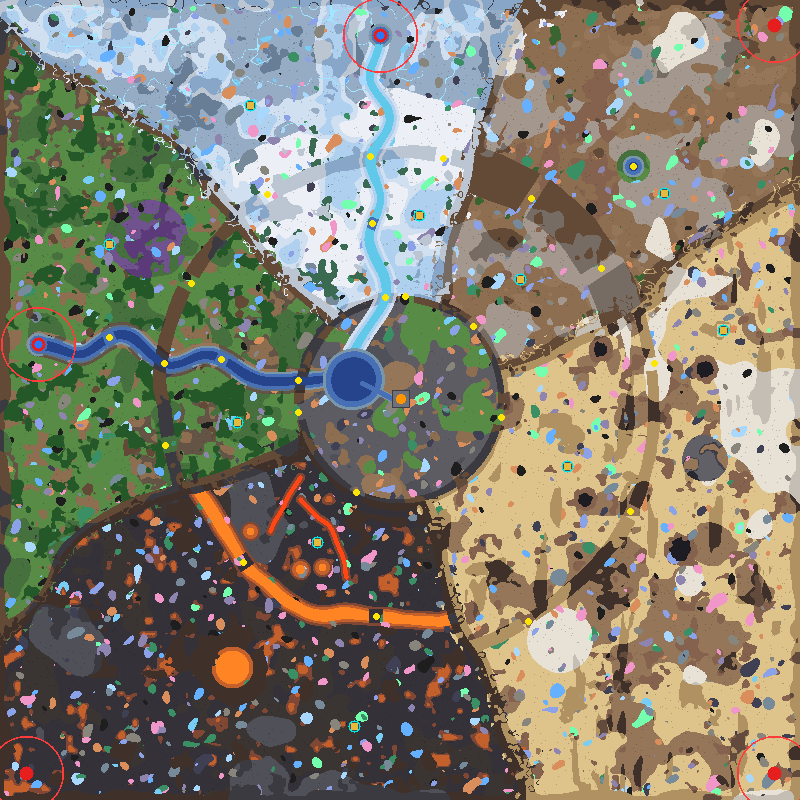
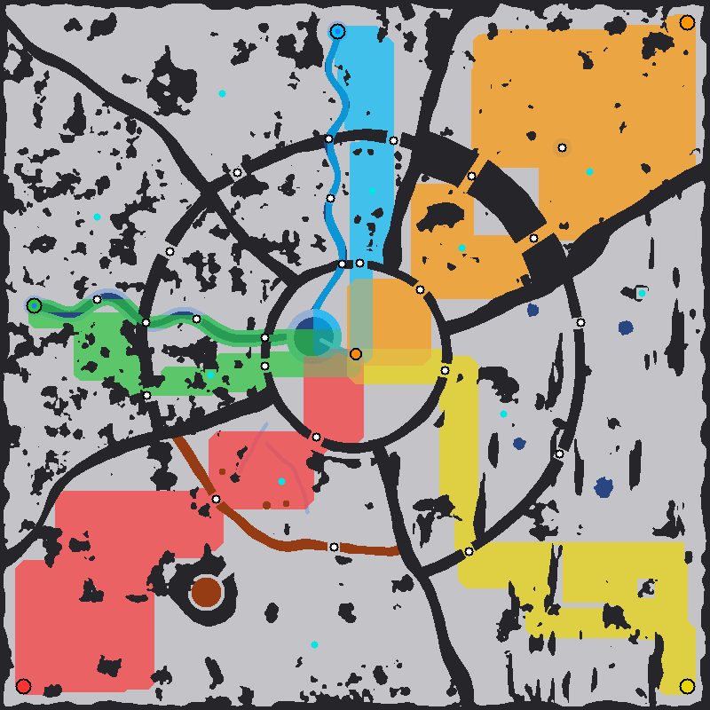

# Biomes Confluence

An 800×800 PvE survival map for **Mindustry v8 Build 159.7** and the **Exogenesis Old** mod
(`exogenesisold` 1.9.1), made by the same generator as Biomes Extended Remastered. It shares that map's
ores, waves, rules and lava patches; only the layout is new. The core stands on the shore of
**Confluence Lagoon**, and **boats** sail to it down two rivers: **Greenwater** (water) from the forest
in the west and **Rimeflow** (cryofluid) from the frozen north.

| | |
|---|---|
| Map file | `maps\Biomes Confluence (Eradication).msav` (save format 13); other difficulties alongside, Normal without a suffix |
| Size | 800 × 800 tiles (640,000) |
| Mode | Survival / PvE, endless waves, five difficulty levels (same rules and wave list as Biomes Extended Remastered) |
| Player core | Core: Foundation at the centre (tiles 399–402 × 399–402), beside the lagoon |
| Enemy spawns | 5 spawn points, one per biome; the forest and frozen spawns are **harbours** on water, the other three sit in the map's corners |
| Naval routes | Greenwater and Rimeflow into the lagoon; boats come to rest 9.5 tiles from the core |
| Ore nodes | Random on every load: about 1,270 patches per game, all 12 ores + siratla crystal in every biome |
| Lava | Thermal generators can be built anywhere on it (molten slag and pyromagma) |
| Required mod | Exogenesis Old 1.9.1 (needs game build 158 or newer) |

*Preview: red circles are enemy spawns with their 37.5-tile drop zones. A blue dot inside one marks a
harbour, where boats spawn. Cyan rings are outpost pads, yellow dots are named choke points and orange
marks the core. North is up. The ore patches are **one example roll**; every game gets its own.*

---

## 1. Play

Turn on **Exogenesis Old**, then import the file of the difficulty you want, for example
`maps\Biomes Confluence (Eradication).msav`, in the editor (or copy it into the game's `maps` folder) and
start it as **Survival**. The rules are the same as on Biomes Extended Remastered:
- on Normal, 7 minutes to set up before wave 1, then one wave every 150 s, endless (other
  difficulties scale both, see section 5);
- a unit cap of 24 plus the core bonus;
- a starting loadout of 700 copper and 300 lead.

To regenerate the map: `python wf_generate.py --map biomes-confluence [--difficulty <level>]`. Leaving
the difficulty out gives Eradication, the hardest (README section 8).

---

## 2. Layout

The map is built in three layers:
- **Confluence Basin** (radius ~100) holds the core plaza, the lagoon and a shallow inlet that runs up
  to the plaza.
- The **Harbour Wall** rings the basin. It has five land gates and two river mouths.
- **Five lanes**, one per biome, lie outside it. Ridges 14–20 tiles thick separate the lanes and have
  no passes (thick enough to stop legged units too).

Each lane runs: spawn → the biome's barrier with its named choke points → the core side → the lane's
gate → core.

| Direction | Biome | Spawn (x, y) | Barrier and its choke points | Gate |
|---|---|---|---|---|
| North | Frozen / glacier | (380, 764), harbour | **Glacier Wall**: Rime Pass, Hoarfrost Pass | North Gate |
| North-east | Semi-arid steppe | (774, 774), top-right corner | **Ochre Mesa**: Ochre Canyon, Wind Gap | North-east Gate |
| South-east | Desert | (774, 26), bottom-right corner | **Dune Wall**: Glass Gap, Mirage Pass, Saltwind Breach | East Gate |
| West | Forest | (38, 455), harbour | **Thornwood**: North Thorn Pass, South Thorn Pass | West Gate |
| South-west | Volcano | (26, 26), bottom-left corner | **lava river**: Cinder Bridge, Obsidian Bridge | South-west Gate |

Features of each biome:
- **Forest:** a spore-moss grove. Greenwater splits the lane, and Old Ford and Mill Ford let ground
  units change banks.
- **Frozen:** the siratla glacier with glowing veins beyond radius ~300. Rimeflow splits the lane,
  with Thaw Ford inside the Glacier Wall.
- **Semi-arid:** Last Oasis.
- **Desert:** tar pits, a wreck field and a salt pan.
- **Volcano:** a crater outside the lava river, and pyromagma creeks and slag pools on the core side.

The biome themes and floors are those of Biomes Extended Remastered, so each biome leans toward the
same ores.

Outpost pads (7×7 core-zone):

| Outpost | Biome | Position | | Outpost | Biome | Position |
|---|---|---|---|---|---|---|
| Meltwater | Frozen | (419, 584) | | Siratla | Frozen | (250, 694) |
| Steppe | Semi-arid | (520, 520) | | Oasis | Semi-arid | (664, 606) |
| Dunewatch | Desert | (567, 333) | | Wreckage | Desert | (723, 469) |
| Millrace | Forest | (237, 377) | | Sporewood | Forest | (109, 555) |
| Ember | Volcano | (317, 257) | | Ashfall | Volcano | (354, 73) |

*Each colour shows one spawn's near-shortest ground routes: cyan north, orange north-east, yellow south-east,
green west, red south-west. Water tinted in a spawn's colour is the route its boats sail. Black is rock,
blue is deep water or cryofluid, brown is lava, and white dots are choke points.*

| Spawn | Ground route to the core | Choke points on it | Boats |
|---|---|---|---|
| North (Frozen) | 461 tiles | Rime Pass, North Gate | 479 tiles down Rimeflow |
| North-east (Semi-arid) | 751 tiles | Last Oasis, Ochre Canyon, Wind Gap, North-east Gate | — |
| South-east (Desert) | 747 tiles | Glass Gap, East Gate | — |
| West (Forest) | 494 tiles | Old Ford, South Thorn Pass, West Gate | 440 tiles down Greenwater |
| South-west (Volcano) | 745 tiles | Cinder Bridge, South-west Gate | — |

Flying units ignore all of this. They enter from the map edge in the direction of their spawn.

---

## 3. Rivers and boats

**Harbour spawns.** The forest and frozen spawns each sit in a shallow-water pool, 9 tiles in radius,
at the head of their river.
- The game puts every wave unit 2 tiles from its spawn tile, and a boat on dry ground dies at once. So
  the pool keeps the boats alive.
- Ground units spawned in the pool simply walk ashore, onto either bank.
- The map still has five spawn tiles, so ground waves are as large as on Biomes Extended Remastered.

**The routes.**
- **Greenwater** (deep water with shallow banks): harbour → Old Ford → **Greenwater Sluice** (through
  the Thornwood) → Mill Ford → **Greenwater Mouth** (through the Harbour Wall) → lagoon → inlet.
- **Rimeflow** (pooled cryofluid with ice banks): harbour → **Rimeflow Sluice** (through the Glacier
  Wall) → Thaw Ford → **Rimeflow Mouth** → lagoon → inlet.
- Cryofluid puts the *freezing* status on boats: 60% speed, and 25% more damage taken
  (`healthMultiplier` 0.8).

**Where they stop.**
- Boats follow the naval flow field toward the core. Dry tiles cost 7000 each in that field and boats
  only move on water, so they gather at the water closest to the core.
- That is the inlet's end at (391, 400), 9.5 tiles from the core's centre. A unit attacks the core
  from `range / 1.3 + 2` tiles; the shortest-ranged boat, risso (~175 world units), does so from about
  19 tiles. **Every boat that reaches the inlet can hit the core.**

**Sluices and fords.**
- A sluice is a deep channel whose bank walls stand on the same liquid. The game's pathfinder closes a
  tile to ground units only when the tile and all eight neighbours are deep ("allDeep"). With the
  liquid under the walls, ground units cannot path through a sluice, and nothing can be built in it
  (blocks need non-deep ground). Boats sail straight through.
- The fords and the inlet are shallow. Ground units cross the fords, and players can build on both.

---

## 4. Resources

Ore patches (6+ tiles) per game, averaged over 5 simulated rolls of the in-game filters:

| Ore | Desert (E) | Semi-arid (NE) | Frozen (N) | Forest (W) | Volcano (SW) | Basin |
|---|---|---|---|---|---|---|
| copper | 31 | 15 | 17 | 16 | 25 | **16** |
| lead | 27 | 14 | 15 | **24** | 27 | **14** |
| coal | 30 | 13 | 13 | **30** | 21 | 6 |
| titanium | 25 | **24** | **35** | 23 | 20 | 7 |
| scrap | **45** | 12 | 12 | 13 | 21 | 5 |
| thorium | 21 | 14 | 13 | 15 | **35** | 3 |
| beryllium | 15 | 12 | 12 | 11 | **34** | 5 |
| tungsten | 19 | 14 | 10 | 13 | **36** | 4 |
| dytrix | 17 | **20** | 13 | 10 | 16 | 3 |
| urbium | **36** | 10 | 14 | 12 | 15 | 4 |
| siradamite | 19 | 11 | **22** | 14 | 17 | 4 |
| stellar steel | 21 | 9 | **17** | 13 | 17 | 4 |
| siratla crystal | 14 | 4 | 13 | 8 | 11 | 2 |

In total there are about 1,273 patches per game (median 34 tiles; 10–89 tiles for 80% of them). Bold
marks a biome's leaning; the desert is the largest biome, so it has many patches of everything.

Special floors include:
- water: 5,550 tiles in the forest, 3,579 in the basin;
- cryofluid: 2,301 tiles in the frozen north, 494 in the basin;
- glowing veins (cold plasma): 1,757 tiles;
- slag: 4,297 tiles, and pyromagma: 712 tiles;
- hotrock/magmarock: 19,049 tiles;
- shale: 13,806 tiles in the desert, 6,614 in the steppe;
- tar: 881 tiles.

---

## 5. Waves

The wave list is the shared BIOME FFA list described in the README, section 6. Here the boats stay
boats, and each naval group comes up **both** rivers, one copy pinned to each harbour, so there are 133
spawn groups (125 + 8 naval copies). The naval groups:

| Group | Waves |
|---|---|
| minke | from wave 14 |
| bryde | from wave 20 |
| risso | from wave 23 |
| cyerce | waves 25–101 |
| orca | from wave 80 |
| balaenoptera | from wave 180 |
| apotheosis (boss, 6,000,000 HP) | from wave 250 |

As in BIOME FFA, the navanax boss never spawns, because its end wave lies before its first.

Boats come from 2 spawns instead of the 5 their land stand-ins use on Biomes Extended Remastered, so
waves here are slightly smaller. On Normal:

| Waves | 1–10 | 11–20 | 21–30 | 31–40 | 41–50 | 61–70 | 91–100 | 111–120 | 141–150 | 191–200 | 241–250 | 251–260 | 301–310 |
|---|---|---|---|---|---|---|---|---|---|---|---|---|---|
| Units per wave | 19 | 72 | 123 | 184 | 252 | 252 | 268 | 288 | 371 | 573 | 709 | 728 | 812 |
| Total HP per wave | 5.1k | 37k | 83k | 193k | 462k | 683k | 1.48M | 1.93M | 6.87M | 9.04M | 16.7M | 33.2M | 110M |

**Difficulty levels.** The same five levels as on Biomes Extended Remastered (README section 6): the
game's own enemy health, enemy unit and wave timer multipliers. The unit multiplier applies to boats
too (two apotheosis per harbour on Eradication).

| Level | Enemy health | Enemy units | Between waves | Before wave 1 | Units / total HP per wave, waves 1–10 | 41–50 | 91–100 | 141–150 | 291–300 |
|---|---|---|---|---|---|---|---|---|---|
| Casual | ×0.5 | ×0.5 | 300 s | 14 min | 16 / 2.1k | 167 / 174k | 178 / 599k | 249 / 3.2M | 463 / 18M |
| Easy | ×1 | ×0.75 | 225 s | 10.5 min | 17 / 4.5k | 208 / 408k | 232 / 1.3M | 304 / 6.6M | 630 / 40M |
| Normal | ×1 | ×1 | 150 s | 7 min | 19 / 5.1k | 252 / 462k | 268 / 1.5M | 371 / 6.9M | 791 / 42M |
| Hard | ×1.25 | ×1.5 | 120 s | 5.6 min | 38 / 13k | 440 / 1.0M | 469 / 3.4M | 629 / 14M | 1,272 / 67M |
| Eradication | ×1.5 | ×2 | 90 s | 4.2 min | 43 / 17k | 530 / 1.4M | 565 / 4.6M | 776 / 21M | 1,633 / 132M |

---

## 6. What was verified

`python wf_generate.py --map biomes-confluence` re-reads the written file with the game's own region
checks and then tests:
- **Map file:** names, spawn marks and pins; the ore filters (37, re-rolled on every load); both data
  patches; thermal generators on lava (4,063 of 4,288 2×2 spots placeable; the rest sit under walls or
  at the map edge).
- **Ground routes:** every spawn reaches the core on foot.
- **10 barrier tests over the whole map**, under the game's allDeep rule (see section 3):
  - With a lane's choke points closed, its spawn cannot reach the core.
  - With its gate closed, the land behind the choke points cannot either.
  - The same tests run without the sealed sluice walls report a leak at all four river crossings,
    which shows the tests can catch one.
- **Boats:** both harbour rings are shallow liquid. Following a port of the game's naval flow field,
  boats from both harbours come to rest 9.5 tiles from the core.
- **Name audit:** `audit_names.py` checked all 88 block names and all 48 wave unit types (8 of them
  boats) against the game and the mod: none unknown.

**Not tested in the game itself.** Please confirm once in the game that boats sail down both rivers
and attack the core from the inlet.

### Sources

- Mindustry source code at release **v159.7**: `Pathfinder` (`costGround`, `costNaval`, `packTile`,
  `Flowfield.passable`), `WaveSpawner`, `UnitComp`, `WaterMoveComp`, `EntityCollisions.waterSolid`,
  `GroundAI`, `Build.validPlace`, `Blocks` (liquid floors), `UnitTypes` (naval weapons) and
  `StatusEffects` (freezing, boss). <https://github.com/Anuken/Mindustry/tree/v159.7>
- Exogenesis Old unit definitions (`content/units/vanilla/orca.json`, `balaenoptera.json`,
  `Quantra/apotheosis.json`). <https://github.com/AureusStratus/ExoGenesis>
