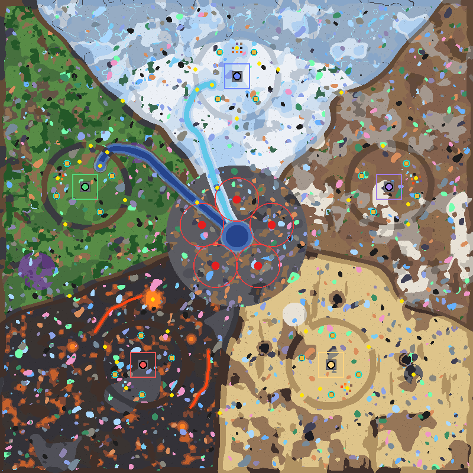
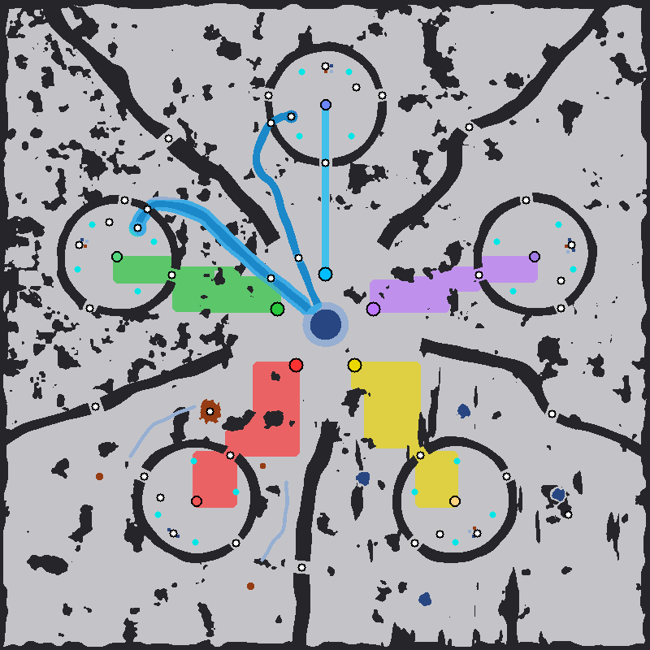

# Biomes Warfront

An 800×800 **PvP map for 5 players** for **Mindustry v8 Build 159.7** and the **Exogenesis Old** mod
(`exogenesisold` 1.9.1), made by the same generator as Biomes Extended Remastered and Biomes Confluence.
Each player gets a walled base in one of the five biomes, handed out at random. **Every base has every
floor resource**: plenty of its own biome's, one small pocket of each of the others, and a pool of
arkycite. Waves rise from **the Rift** in the middle and strike any player. A slot nobody takes becomes a
**defender bot** that never attacks.

| | |
|---|---|
| Map file | `maps\Biomes Warfront (Eradication).msav` (save format 13); other difficulties alongside, Normal without a suffix |
| Size | 800 × 800 tiles (640,000) |
| Mode | **PvP** for up to 5 players (teams sharded, crux, malis, green, blue), plus endless PvE waves from the centre; five difficulty levels |
| Player cores | 5 × Core: Foundation, each 270 tiles from the centre, one per biome (section 2) |
| Waves | 5 spawn points around the lagoon in the middle; the RTS AI sends every squad at a player it picks |
| Empty slots | After 3 minutes, every slot without a player becomes a defender fortress (section 5) |
| Naval routes | Greenwater and Rimeflow link the forest and frozen bases through the centre |
| Ore nodes | Random on every load: about 1,300 patches per game, all 12 ores + siratla crystal in every biome |
| Lava | Thermal generators can be built anywhere on it (molten slag and pyromagma) |
| Required mod | Exogenesis Old 1.9.1 (needs game build 158 or newer) |

*Preview: each base's core in its team colour, framed by the square its defender fortress would take.
Red circles are the five wave spawns in the Rift with their 37.5-tile drop zones, cyan rings are outpost
pads and yellow dots are gates, passes, fords and other named places. North is up. The ore patches are
**one example roll**; every game gets its own.*

---

## 1. Play

1. Turn on **Exogenesis Old** under *Mods* and restart the game.
2. Import the map file of the difficulty you want (*Editor → Import Map*), for example
   `maps\Biomes Warfront (Eradication).msav`, or copy it into the game's `maps` folder.
3. Host it: *Play → Host Multiplayer Game*, pick the map and the **PvP** mode. On a dedicated server:
   `host Biomes_Warfront_(Eradication) pvp` (underscores stand for spaces).

**Who gets which base is random, the host included.** When the game starts, the host is put through the
game's team assigner too (`Control`: `player.team(netServer.assignTeam(player))`). Every player who joins
later goes the same way. The assigner picks a team with a core and the fewest players and breaks ties at
random (`NetServer.assigner`), so the first five players each get a random free base. A map cannot pin a
player to a base, so the host cannot be sent to the desert from the map file.

The map's own rules make it a PvP match whatever mode is picked:
- **Win:** the last team with a core wins (attack mode). Defender bots count as teams, so their cores
  must fall too.
- **Waves:** on Normal, 7 minutes before wave 1, then one wave every 150 s, endless; the other levels
  scale both times (section 4). Nobody can call a wave early, since that would send it at everyone.
- **Bases:** a unit cap of 24 plus the core bonus per team. Every core starts with 700 copper and
  300 lead.
- **Planet:** set to **<Any>**, so Serpulo, Erekir and Exogenesis blocks can all be built.

| Base | Team (colour) | Core (x, y) |
|---|---|---|
| Frozen, north | blue (5) | (400, 670) |
| Semi-arid, east | malis (3, purple) | (657, 483) |
| Desert, south-east | sharded (1, yellow) | (559, 182) |
| Volcano, south-west | crux (2, red) | (241, 182) |
| Forest, west | green (4) | (143, 483) |

To regenerate the map: `python wf_generate.py --map biomes-warfront [--difficulty <level>]`. Leaving
the difficulty out gives the hardest level, Eradication, with the strongest bots.

---

## 2. Layout

The map is cut into five equal 72° sectors around the centre, one biome each. Every base has the same
geometry; only the biome around it differs:
- a Foundation core on an 18×18 metal plaza;
- a clear square of 47×47 tiles around it, the room a defender fortress needs;
- four outpost pads (core-zone, 7×7);
- a resource garden behind the core and an arkycite pool (section 3);
- a **rampart**: a ring of vanilla walls about 66–80 tiles from the core, 11–15 tiles thick.

The rampart has three gates: one toward the Rift and one toward each neighbour. No rocks or trees stand
inside a rampart, so every base has the same room to build.

| Base | Rift gate | Gates toward the neighbours |
|---|---|---|
| Frozen | Frozen Rift Gate (400, 599) | Frozen Steppe Gate (470, 682), Frozen Forest Gate (330, 682) |
| Semi-arid | Steppe Rift Gate (589, 461) | Steppe Frozen Gate (647, 553), Steppe Desert Gate (690, 420) |
| Desert | Desert Rift Gate (517, 239) | Desert Steppe Gate (623, 213), Desert Volcano Gate (510, 131) |
| Volcano | Volcano Rift Gate (283, 239) | Volcano Desert Gate (290, 131), Volcano Forest Gate (177, 213) |
| Forest | Forest Rift Gate (211, 461) | Forest Volcano Gate (110, 420), Forest Frozen Gate (153, 553) |

**The Rift** is the neutral basin in the middle (radius 120): Confluence Lagoon with the five wave spawns
on its shore, 62 tiles from the centre, each facing one base. A cleared road runs from each spawn to its
base's Rift gate.

**Separator ridges**, 14–20 tiles thick, run along the sector borders from the Rift to the map edge.
Each ridge has one **flank pass**, so neighbours can also meet without crossing the Rift:

| Pass | Between | Position |
|---|---|---|
| Hoarwind Pass | Frozen and Semi-arid | (577, 643) |
| Frostwood Pass | Frozen and Forest | (207, 629) |
| Ashgrove Pass | Forest and Volcano | (117, 299) |
| Cinderdune Pass | Volcano and Desert | (371, 101) |
| Saltsteppe Pass | Desert and Semi-arid | (679, 290) |

**Distances.** In straight lines all bases are alike:
- each wave spawn is 208 tiles from the base it faces;
- neighbouring cores are 317–318 tiles apart, the others 513–514.

Counted in the game's 4-way pathfinding steps, routes along the diagonals come out longer:
- a wave spawn to its base: 205 tiles (frozen), 259 (semi-arid, forest) and 294 (desert, volcano);
- neighbouring bases: 462–483 steps;
- other bases: 598–717 steps.

*Routes: each wave spawn's near-shortest ground corridor to the base it faces, in that base's colour
(the RTS AI may send a squad to any base). The blue and cyan water is the boat route between the forest
and frozen harbours.*

---

## 3. Resources

Every floor resource except arkycite has **one home biome**, where there is a lot of it:

| Resource | Home biome | Elsewhere |
|---|---|---|
| Water | Forest (Greenwater, harbour) | one 4×4 pocket of shallow water in each other base |
| Arkycite | none: shared by all | one round pool of 37 tiles in every base, at the same spot |
| Spore moss | Forest (spore groves) | one 4×4 pocket |
| Cryofluid | Frozen (Rimeflow, harbour) | one 4×4 pocket |
| Cold plasma (glowing vein) | Frozen (siratla glacier) | one 4×4 pocket |
| Oil-rich ground (shale) | Semi-arid (shale fields) | one 4×4 pocket |
| Oil (tar) | Desert (tar pits) | one 4×4 pocket |
| Sand floor (sand, darksand) | Desert (the whole biome) | one 4×4 pocket of darksand |
| Slag (lava) | Volcano (crater lake, pools) | one 4×4 pocket |
| Pyroplasma (pyromagma) | Volcano (creeks) | one 4×4 pocket |
| Heat (hotrock, magmarock) | Volcano (the whole biome) | one 4×4 pocket of magmarock |

Each base's pockets sit together in its **resource garden**, inside the rampart behind the core: a 3×3
grid of 4×4 pockets (16 tiles each), 7 tiles apart. A 4×4 pocket takes four 2×2 thermal generators or
pumps, or one 4×4 block.

The biome floors are chosen so that no biome has any other biome's resource floor outside its garden;
for example, the river banks in the forest are mud, not darksand.

**Arkycite** is Erekir's liquid floor: "Arkycita" in the Portuguese game text, block `arkycite-floor`.
- **Use:** Erekir's chemical combustion chamber, pyrolysis generator and neoplasia reactor. Since the
  planet is set to <Any>, these can be built.
- **Where:** it has no home biome. Every base has one round pool of 37 tiles inside its rampart, at the
  same spot.
- **Ground units:** they drown in it, as in deep water, so the middle of the pool is closed to them.

The checks count every base (usable tiles, not under a wall):

| Base | Home resources (usable tiles) | Every other resource | Arkycite |
|---|---|---|---|
| Frozen | cryofluid 1,829; glowing vein 1,261 | 16 tiles each (8 pockets) | 37 |
| Semi-arid | shale 31,253 | 16 tiles each (9 pockets) | 37 |
| Desert | sand floor 104,518; tar 793 | 16 tiles each (8 pockets) | 37 |
| Volcano | hotrock/magmarock 16,223; pyromagma 956; slag 765 | 16 tiles each (7 pockets) | 37 |
| Forest | water 3,528; spore moss 1,930 | 16 tiles each (8 pockets) | 37 |

The Rift is neutral and holds the lagoon: 4,297 tiles of water and 745 of cryofluid.

**Ores** are rolled by the game on every load, from the same filters as the other maps, so every ore can
turn up in every biome. Each biome only leans toward some of them. Five simulated rolls averaged about
1,300 patches per game (median 33 tiles; 10–86 tiles for 80% of them). Patches per biome (bold = the
biome's leaning):

| Ore | Frozen | Semi-arid | Desert | Volcano | Forest | Rift |
|---|---|---|---|---|---|---|
| copper | 23 | 21 | 28 | 21 | 14 | **32** |
| lead | 18 | 18 | 22 | 19 | **23** | **29** |
| coal | 16 | 16 | 18 | 19 | **29** | 7 |
| titanium | **40** | **21** | 23 | 17 | 19 | 9 |
| scrap | 16 | 17 | **34** | 16 | 13 | 6 |
| thorium | 16 | 17 | 22 | **33** | 15 | 8 |
| beryllium | 15 | 15 | 16 | **31** | 13 | 6 |
| tungsten | 13 | 13 | 15 | **30** | 12 | 5 |
| dytrix | 13 | **28** | 17 | 13 | 12 | 6 |
| urbium | 11 | 9 | **34** | 10 | 14 | 5 |
| siradamite | **26** | 11 | 16 | 14 | 14 | 6 |
| stellar steel | **25** | 14 | 13 | 12 | 13 | 6 |
| siratla crystal | 17 | 5 | 12 | 12 | 10 | 2 |

**Lava.** The same two data patches as on the other maps let thermal generators stand anywhere on molten
slag and pyromagma. All 1,388 2×2 spots fully on lava are placeable, including the slag pockets in the
gardens.

---

## 4. Waves

The wave list is the shared BIOME FFA list (README, section 6). There are no naval wave spawns: a
boat wave could only reach the two river bases, so the boats get their land stand-ins. With five spawn
points, every wave is exactly as on Biomes Extended Remastered at the same difficulty (125 spawn
groups; README section 6 has the numbers per level). Here they are shared by all players.

How the waves pick their targets:
- **The wave team.** Waves come from a sixth team (neoplastic). In PvP the game treats no team as AI,
  so this team runs the game's **RTS AI**, which works in PvP too.
- **Target choice.** Every 2 s the RTS AI gathers idle units into squads. Each squad then attacks a
  target it picks from all players' cores, drills, generators, factories and batteries: it shuffles
  15 candidates and takes the easiest kill (`RtsAI.findTarget`). It is set to attack at once.
- **The result.** A wave can go to one base or split across several, and it favours weakly defended
  ones. Strongly defended targets, such as a bot fortress, are attacked rarely.
- **Flyers** rise from the same spawns in the Rift (`airUseSpawns`). By default the game would place
  them on the map edge, behind the bases.
- **Drop zones.** When a wave spawns, every player unit within 37.5 tiles of a spawn is destroyed. The
  drop zones cover most of the Rift, including the river mouths, so the centre is dangerous at wave
  time.

| Level | Enemy health | Enemy units | Between waves | Before wave 1 |
|---|---|---|---|---|
| Casual | ×0.5 | ×0.5 | 300 s | 14 min |
| Easy | ×1 | ×0.75 | 225 s | 10.5 min |
| Normal | ×1 | ×1 | 150 s | 7 min |
| Hard | ×1.25 | ×1.5 | 120 s | 5.6 min |
| Eradication | ×1.5 | ×2 | 90 s | 4.2 min |

---

## 5. Defender bots (empty slots)

The map carries one hidden **world processor**: a privileged, indestructible logic block of the wave
team, in the dark map border at (1, 1). Its program (210 instructions):

1. **Join window.** It waits **180 s** after the map starts, so players can join.
2. **Fortress.** Every player team that still has a core but no player becomes a fortress:
   - `setrule` raises its block health, block damage, unit health and unit damage. These multipliers
     act on what it already has as well, its core included.
   - `setblock` builds 4 **spectres**, 4 **ripples** and 4 **cyclones** around the core, plus a closed
     square ring of 80 **large thorium walls** 19–21 tiles out.
   - `setprop` loads the turrets: thorium, plastanium and surge alloy.
   - `spawn` adds guards: 4 **fortresses** and 1 **scepter**. In PvP, units without a command hold
     position and shoot whatever comes in range.
3. **Upkeep.** Every **15 s** it reloads the turrets' ammo and replaces lost guards. Destroyed turrets
   and walls are **not** rebuilt, so a fortress can be worn down.
4. **Late joiners.** If a player joins a bot team later (the game puts new players on the emptiest
   team), that team gets normal multipliers back. The player keeps the fortress and the processor
   stops looking after it.

A bot **never attacks**: it builds no factories and its guards hold position. It still counts as a
team, so it must be destroyed to win.

| Level | Block health | Block damage | Unit health | Unit damage |
|---|---|---|---|---|
| Casual | ×2 | ×1 | ×1.5 | ×1 |
| Easy, Normal | ×4 | ×2 | ×3 | ×2 |
| Hard | ×5 | ×2.5 | ×3.75 | ×2.5 |
| Eradication | ×6 | ×3 | ×4.5 | ×3 |

The bot multipliers are the Normal values (`sys_config.cdtBotRules`) times the level's enemy health
factor. The map description in the game lists the values of its level.

---

## 6. Rivers and boats

- **Harbours.** Greenwater (water) starts at the **Forest Harbour** (169, 519), and Rimeflow
  (cryofluid) at the **Frozen Harbour** (358, 656). Both harbours lie inside their base's rampart.
- **Sluices.** Each river leaves its rampart through a sluice: a deep channel whose banks are walls
  standing on the same liquid. The Greenwater Sluice is at (181, 542) and the Rimeflow Sluice at
  (333, 648).
  - Boats pass through a sluice; ground units cannot.
  - The sluices count under the game's allDeep rule: the rampart tests pass with all gates closed.
- **Rift fords.** Both rivers end in Confluence Lagoon. Rift Ford (Greenwater) at (333, 457) and Rift
  Ford (Rimeflow) at (367, 482) are shallow crossings that keep the land around the lagoon one ring.
- **Boat raids.** With a port of the game's naval flow field:
  - boats from the forest harbour reach the Frozen Harbour after 723 tiles and stop 37.7 tiles from the
    frozen core;
  - boats from the frozen harbour reach the Forest Harbour after 727 tiles and stop 33.8 tiles from the
    forest core.

  They cannot come closer, because the fortress square keeps water at least 24 tiles from every core.
  Long-range boats can still shell the base from there.
- **Other bases.** The other three bases have only their 4×4 water pocket. They can build boats, but the
  pocket has no way out.

---

## 7. What was verified

`python wf_generate.py --map biomes-warfront` re-reads the written file with the game's own region
checks and then tests:
- **Map file:** names, spawn marks and wave groups (no boat on dry ground); the 37 ore filters; both data
  patches; thermal generators on all 1,388 lava spots.
- **PvP setup:**
  - five cores with the right teams;
  - the rules: PvP, attack mode, waves from team 6 with the RTS AI, flyers from the spawns;
  - the world processor: team 6, code that passes a check mirroring the game's logic parser, and every
    core looked after twice (decide and upkeep);
  - every fortress square clear of walls and liquids.
- **Resources:** every base has every resource:
  - each foreign one 1–16 usable tiles;
  - each home one 300 or more;
  - arkycite 30–60 (37 in every base).
- **Ground routes:** every wave spawn reaches every base, and every base reaches every other.
- **10 barrier tests** under the game's allDeep rule:
  - With a base's three gates closed, the wave spawn facing it cannot reach its core (rampart and
    sluice hold).
  - With a flank pass closed, its two sectors cannot reach each other outside the Rift.
- **Boats:** both naval links arrive in the other river base's harbour.
- **Name audit:** `audit_names.py` found no unknown name. It checked:
  - all 88 block names and all 44 wave unit types against v159.7 and the mod;
  - the processor's statements, team rules and fetch types against `LStatements`, `LogicRule` and
    `FetchType`;
  - the content it uses (spectre, ripple, cyclone, large thorium wall, thorium, plastanium, surge alloy,
    fortress, scepter).

**Not tested in the game itself.** No game client was run. Please host the map once as PvP with one or
two players and confirm:
- the empty slots turn into fortresses after 3 minutes;
- a wave leaves the Rift and attacks;
- boats sail from one river base to the other.

Some servers disable world processors (`disableWorldProcessors`); there, empty slots stay plain cores.

### Sources

Mindustry source code at release **v159.7** (<https://github.com/Anuken/Mindustry/tree/v159.7>):
- **PvP:** `Team` (`isAI`), `Logic` (`checkGameState`, team AI update), `NetServer` (team assigner),
  `Gamemode` (`pvp`), `MapIO` (teams with cores), `ServerControl` (`host`).
- **Waves:** `Rules` (`TeamRule`, `airUseSpawns`, `waveTeam`), `RtsAI`, `WaveSpawner`, `CommandAI`,
  `UnitType` (`controller`).
- **Bots:** `LogicBlock` (`LogicBuild.write/read`, `compress`, limits), `LParser`, `LStatements`,
  `LExecutor` (`SetRuleI`, `SetBlockI`, `SpawnUnitI`, `FetchI`, `maxInstructions`), `LogicRule`,
  `FetchType`, `GlobalVars`, `BuildingComp` (`setProp`, damage and health multipliers), `ItemTurret`,
  `TypeIO`.
- **Content:** `Blocks` (`worldProcessor`, `spectre`, `ripple`, `cyclone`, `thoriumWallLarge`).

Exogenesis Old by AureusStratus: <https://github.com/AureusStratus/ExoGenesis>
